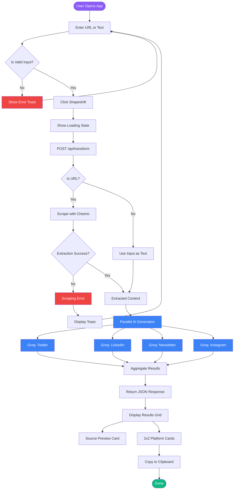
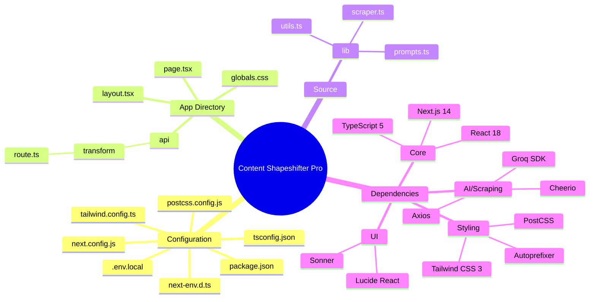
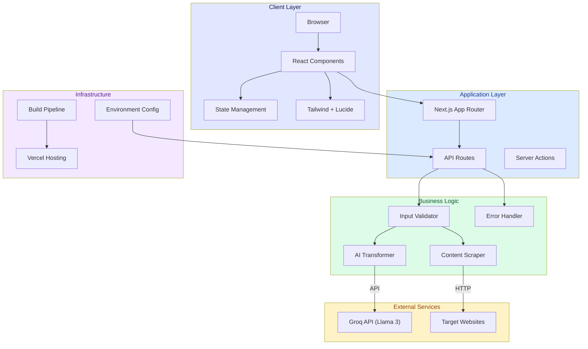
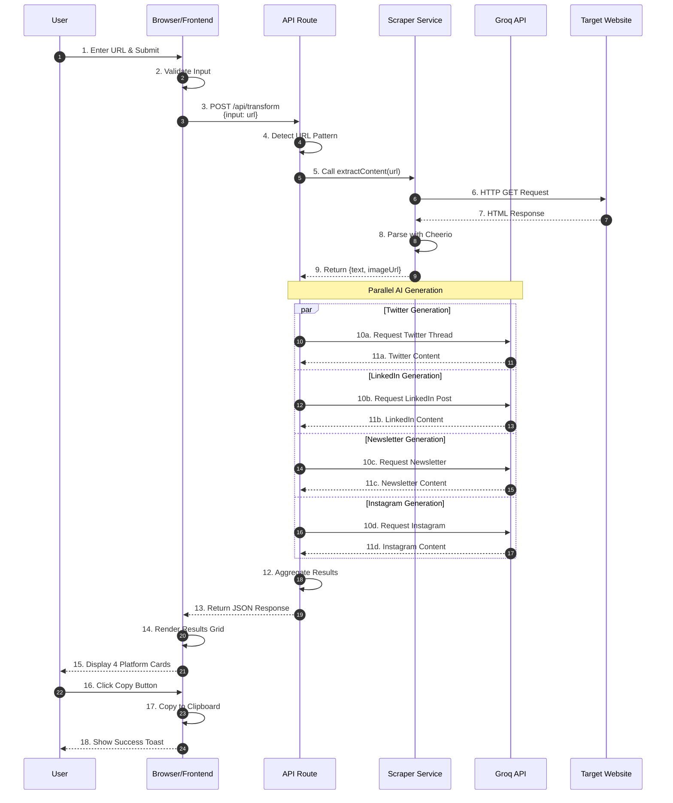

# Mermaid.js Diagram Prompts for Content Shapeshifter Pro

## Prompt 1: Application Flow Diagram

```
Create a Mermaid.js flowchart diagram showing the complete application flow for "Content Shapeshifter Pro". Include:

1. User Journey:
   - User enters URL or text
   - Input validation
   - API request initiated

2. Backend Processing:
   - URL detection logic
   - Web scraping (Cheerio + Axios) for URLs
   - Content extraction (text + image)
   - Parallel AI generation (4 Groq API calls)
   - Response aggregation

3. Frontend Display:
   - Loading states
   - Source preview (image + text)
   - Results grid (4 platform cards)
   - Copy functionality

4. Error Handling:
   - Invalid URL errors
   - Scraping failures
   - API errors
   - Network issues

Use a flowchart with clear decision points (diamonds), processes (rectangles), and data flow. Color-code: green for success paths, red for error paths, blue for AI processing, purple for user interactions.
```

**Expected Output:**



---

## Prompt 2: Repository Structure Diagram

```
Create a Mermaid.js mindmap showing the complete repository structure for "Content Shapeshifter Pro". Organize by:

1. Root Configuration Files:
   - package.json
   - tsconfig.json
   - next.config.js
   - tailwind.config.ts
   - postcss.config.js
   - .env.local
   - README.md

2. App Directory (Next.js App Router):
   - api/transform/route.ts
   - globals.css
   - layout.tsx
   - page.tsx

3. Source Code:
   - lib/scraper.ts
   - lib/prompts.ts
   - lib/utils.ts

4. Dependencies:
   - Framework: Next.js 14, React 18
   - Language: TypeScript 5
   - Styling: Tailwind CSS
   - AI: Groq SDK
   - Scraping: Cheerio, Axios
   - UI: Lucide React, Sonner

Use different colors for different categories and show the relationship between files.
```

**Expected Output:**



---

## Prompt 3: System Architecture Diagram

```
Create a Mermaid.js architecture diagram showing the complete system architecture for "Content Shapeshifter Pro". Include layers:

1. Presentation Layer:
   - Browser/Client
   - React Components
   - State Management
   - UI Components (Lucide, Tailwind)

2. Application Layer:
   - Next.js App Router
   - API Routes
   - Server Actions
   - Middleware

3. Business Logic Layer:
   - Content Scraping Service
   - AI Generation Service
   - Transformation Engine
   - Error Handler

4. External Services:
   - Groq API (Llama 3)
   - Target Websites (for scraping)

5. Infrastructure:
   - Vercel (hosting)
   - Environment Variables
   - Build Process

Show data flow between layers with arrows. Use component diagrams with clear separation of concerns.
```

**Expected Output:**



---

## Prompt 4: Data Flow Sequence Diagram

```
Create a Mermaid.js sequence diagram showing the data flow for transforming a URL into 4 platform variants. Include:

Actors:
- User
- Browser (Frontend)
- Next.js API Route
- Scraper Service
- Groq Service

Sequence:
1. User submits URL
2. Frontend validates and sends to API
3. API detects URL and calls scraper
4. Scraper fetches and parses webpage
5. Scraper returns extracted content
6. API parallel calls Groq 4 times
7. Groq returns AI-generated content
8. API aggregates and returns response
9. Frontend displays results
10. User copies content

Include timing annotations and show parallel processing clearly.
```

**Expected Output:**



---

## How to Use These Diagrams

1. **Mermaid Live Editor**: Visit https://mermaid.live/ and paste the code
2. **GitHub/GitLab**: Mermaid diagrams render natively in Markdown
3. **VS Code**: Install Mermaid extension for live preview
4. **Documentation**: Embed in README.md or documentation sites

## Tips for Best Results

- Use `%%{init: {'theme': 'dark'}}%%` at the top for dark mode
- Add `autonumber` for sequence diagrams
- Use `style` or `classDef` for custom colors
- Keep diagrams under 30 nodes for readability
- Use subgraphs to organize complex diagrams